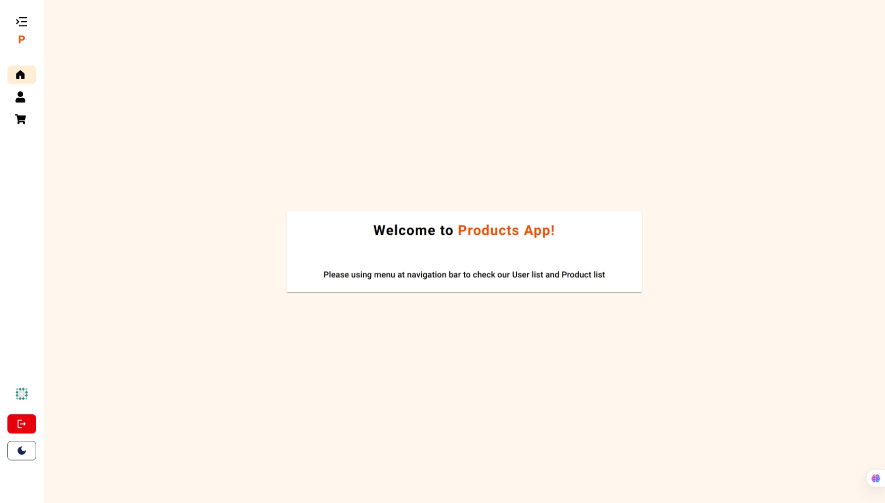

<!-- PROJECT LOGO -->
<div align="center">
  

  <h3 align="center">Project Products</h3>

  <p align="center">
    A project that displaying products list data from REST API
    <br />
    <a href="https://project-products-six.vercel.app">View Demo</a>
    ·
    <a href="https://github.com/naufalf25/project-products/issues/new">Report Bug</a>
  </p>
</div>

<!-- TABLE OF CONTENTS -->
<details>
  <summary>Table of Contents</summary>
  <ol>
    <li>
      <a href="#about-the-project">About The Project</a>
      <ul>
        <li><a href="#built-with">Built With</a></li>
      </ul>
    </li>
    <li>
      <a href="#getting-started">Getting Started</a>
      <ul>
        <li><a href="#installation">Installation</a></li>
      </ul>
    </li>
    <li><a href="#contact-me">Contact Me</a></li>
    <li><a href="#acknowledgments">Acknowledgments</a></li>
  </ol>
</details>

<!-- ABOUT THE PROJECT -->

## About The Project

This project is a website that displays a list of products and users using the REST API from [Dummy JSON](https://dummyjson.com). It includes features such as login, dark mode, and is equipped with a loading process and status alerts.

### Built With

- [![React][React.js]][React-url]
- [![Vite][vite-shield]][vite-url]
- [![TailwindCSS][TailwindCSS]][TailwindCSS-url]
- [![Redux][redux-shield]][redux-url]

<!-- GETTING STARTED -->

## Getting Started

### Installation

1. Clone the repo
   ```sh
   git clone https://github.com/naufalf25/project-products.git
   ```
2. Install NPM packages
   ```sh
   cd project-products
   npm install
   ```
3. Start the development
   ```sh
   npm run dev
   ```

<!-- CONTACT -->

## Contact Me

- [![LinkedIn][linkedin-shield]][linkedin-url]
- [![Gmail][gmail-shield]][gmail-url]

<!-- ACKNOWLEDGMENTS -->

## Acknowledgments

- [React Icons](https://react-icons.github.io/react-icons/search)
- [Material UI](https://mui.com/)
- [React Slick (Slider)](https://react-slick.neostack.com/)

<!-- MARKDOWN LINKS & IMAGES -->
<!-- https://www.markdownguide.org/basic-syntax/#reference-style-links -->

[linkedin-shield]: https://img.shields.io/badge/linkedin-%230077B5.svg?style=for-the-badge&logo=linkedin&logoColor=white
[linkedin-url]: https://www.linkedin.com/in/muhnaufalfarras
[gmail-shield]: https://img.shields.io/badge/Gmail-D14836?style=for-the-badge&logo=gmail&logoColor=white
[gmail-url]: https://mail.google.com/mail/u/0/?tf=cm&fs=1&to=opal.farras@gmail.com
[React.js]: https://img.shields.io/badge/React-20232A?style=for-the-badge&logo=react&logoColor=61DAFB
[React-url]: https://reactjs.org/
[TailwindCSS]: https://img.shields.io/badge/Tailwind_CSS-38B2AC?style=for-the-badge&logo=tailwind-css&logoColor=white
[TailwindCSS-url]: https://tailwindcss.com
[redux-shield]: https://img.shields.io/badge/redux-%23593d88.svg?style=for-the-badge&logo=redux&logoColor=white
[redux-url]: https://redux.js.org
[vite-shield]: https://img.shields.io/badge/vite-%23646CFF.svg?style=for-the-badge&logo=vite&logoColor=white
[vite-url]: https://vitejs.dev
